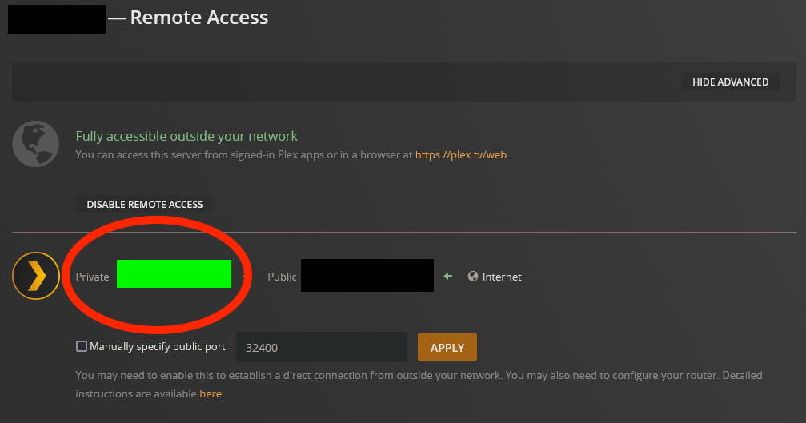
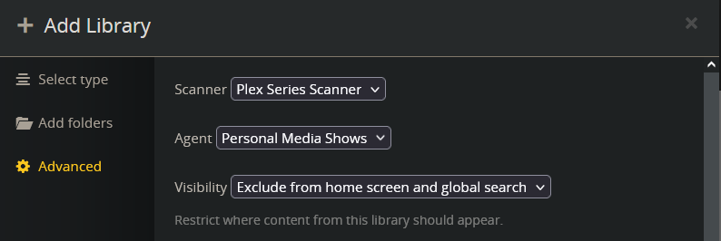
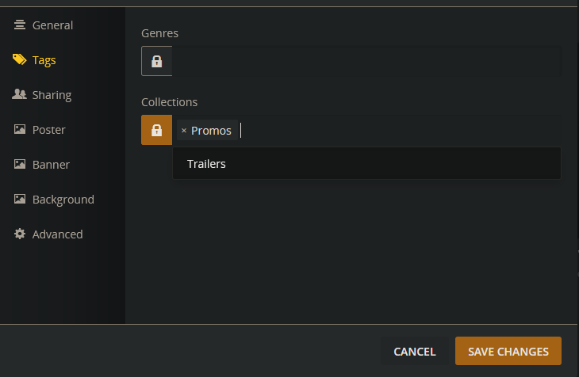

# Open Swim

**Open Swim** (fka. Ogre Swim) is a highly configurable Python script designed to generate TV block style playlists based on your personal media. Some configuration is required in the script, as well as in Plex, to get started.

This read me is geared towards beginners, because I'm also one of those. If you need to make changes to the configuration because you don't simply run a vanilla Plex server on a Windows machine, you're probably smart enough to figure out what changes to make. If anything is unclear, feel free to hit me up [@ogremode](https://twitter.com/ogremode). (It may take me a minute to notice your reply and get back to you--don't be annoying and don't be an asshole.)

Included in this package are a few example set-up scripts. OS.py (Open Swim) is designed to generate a TV block of episodes with bumpers around each episode and promos in-between them. OCM.py (Open Classic Movies) is designed to generate a block of movies with trailers, promos, and pre-show cartoons. Finally, OBO.py (Open Box Office) will generate a mixed block of movies, promos, and television shows. You can copy these scripts and mix and match these configurations to create a variety of TV block style playlists to fit your own needs.

## Before setting up Open Swim
### Install Python
Before setting up Open Swim, you will need to have a working Plex library, and you will need to have [installed Python](https://www.python.org/downloads/). You can check if Python is installed by opening the command prompt and typing "python --version".

### Install requirements.txt
After installing Python and downloading the package, navigate to the unzipped folder and click into the Windows Explorer bar, then type cmd and press enter. This will open an instance of the Command Prompt in this folder. Type the command below into CMD to install the Python requirements to run this script.

> pip install -r requirements.txt

### Prepare Open Swim For Plex: Configure your .env file
The .env file is a set of unique parameters that reference your Plex library that are shared between the Open Swim scripts in the same directory. I chose this method instead of plugging the URL and token into each individual script for the sake of convenience.

#### Rename your file
Remove the name "Example" from your Example.env file. Keep the .env extension.

#### Update the PLEX_URL parameter
Right-click on the included .env file and open with a text editor (like Notepad or [Notepad++](https://notepad-plus-plus.org/downloads/)). You will need to change both of these settings to your own configuration.

You can identify your PLEX_URL by opening the server software and navigating to Settings -> Remote Access. It should look something like this. 

The **private** IP address will be what you want to plug into your .env file. Make sure you include HTTP in front of your set up, and make sure you wrap it in quotes.

Your configuration here may vary if your Plex set up is more complicated. In that case, you should know what your private IP is.

#### Update the PLEX_TOKEN parameter
[Follow the instructions here to find your Plex token.](https://support.plex.tv/articles/204059436-finding-an-authentication-token-x-plex-token/)

You do not need to wrap your Plex token in quotes.

### Prepare Plex for Open Swim: Create libraries and collections
The Open Swim scripts work with Plex by querying [Collections](https://support.plex.tv/articles/201273953-collections/) within your Plex library. The behavior behind what gets selected from and what order the content gets placed in depends on the category associated with the collection. Besides TV and movies, the special category these scripts require is a library to hold the ancilleary media you want to include in your playlists—called "Promos" for the purposes of these script. If you don't want to include interstitials in your playlist, you can turn this feature off.

#### Create a promos library
Promos, bumpers, trailers, and prerolls are all interstitial style content that you don't want to show up on your Home playlist. These are not TV shows, and Plex's matching will mangle them. If you are going to use this style of content, I highly recommend creating a TV library specifically for these kinds of media. You will want to use these settings to prevent Plex from trying to match your content to the TVDB, and to prevent half-watched interstitials from showing up in your Continue Watching list on the Plex home page.

Plex may fail to find all of your promo media. [You may need to rename your media to match Plex's TV show standards.](https://support.plex.tv/articles/naming-and-organizing-your-tv-show-files/) I use [Advanced Renamer](https://www.advancedrenamer.com/) for this; I've included a copy of my rename settings in this package (S01E00 Rename.aren).

As for where to find this kind of content, I recommend using JDownloader or some other batch downloader and going out to find the content you want. BumpWorthy.com is a good resource, and so is Archive.org. Get creative—I've been having fun watching codec calls from Metal Gear Solid, Ebert and Siskel reviews, and classic trailers in-between episodes of TV shows.

#### Add content to collections
To add a TV show, interstitial content, or media to a collection, right click on the media, and update the Collection tags like so. You can include content in multiple collections.

## Configure your Open Swim scripts

To configure your Open Swim scripts, I recommend opening one of the example scripts and exploring the options. I've also included lots of comments in these scripts, mostly to remind myself what each thing is doing.

- **PLAYLIST_TITLE** - Set this to whatever you want your playlist to be called. Make sure it is wrapped on both sides in single quotes.

Each content group has a set of configurable parameters. Below I've outlined the standard parameters for each content group.

- **_ACTIVE** parameters determine whether or not to include that type of content in your playlist. If these are set to 0, the script will try to include the content. If the parameter is set to 1, it will not look for this content to include. If the parameter is set to 1, the rest of that content group's parameters are ignored and do not need to be set up.
- **_LIBRARY_TITLE** should match the name of the Plex library the content group is pulling from. Each content group has a library parameter so that you can organize your media the way you want to. The default library title for TV content will be Plex's default, "TV Shows". The default library title for Movie content will be Plex's default "Movies". The default library title for interstitial content will be "Promos".
- **_COLLECTION_TITLE** should match the name of the Plex collection *within the library above* that the content group is pulling from. Each content group has a collection parameter so that you can organize your media the way you want to.

Below I will explain the behavior for each type of content group, as well as any unique parameters they have.

### Next Episodes
**Next Episodes** are TV shows you want to include in the TV block that you want to watch in season order. The script will find the next episode of these TV shows and include them in the playlist. If a show in the Next Episodes collection has a season 0 (which usually contains specials and related media), the season 0 will be skipped.

The **Next Episodes** content group has no unique parameters. The default library title is "TV Shows", and the default collection title is "Next Episodes".

### Reruns
**Reruns** are TV shows you want to watch in random order. The script will find a random episode from each of these TV shows and include them in the playlist. If a show in the reruns collection has a season 0 (which usually contains specials and related media), the season 0 will be skipped.

The default library title for the Reruns content group is "TV Shows", and the default collection title is "Reruns".

By changing RERUNS_LOOKBACK, you can configure how many days to pass before seeing an episode you already watched. If none are found within this lookback parameter, the lookback is ignored.

You can configure the number of rerun episodes you want to include in the playlist by changing RERUNS_MAXIMUM and RERUNS_MINIMUM. The maximum will also be the number of series that are selected from for the playlist. A random number between these two integers will be chosen and placed within the playlist. If you always want X amount of reruns to be in the playlist, change both of these parameters to the same number. **Note that the script may fail if there are not enough shows associated with the rerun collection to reach the maximum.**

You can configure how many episodes per show you want to include in the playlist by updating RERUNS_EPISODES_PER_SHOW.

### Promos
**Promos** are commercials, interstitials, or other short media that you want to play between each episode or movie in the playlist. 

The default library title for the Promos content group is "Promos", and the default collection title is "Promos".

By changing PROMO_LOOKBACK, you can configure how many days to pass before seeing a promo you already watched. If none are found within this lookback parameter, the lookback is ignored.

You can configure the number of promos to placed between each episode by updating PROMO_MAXIMUM_BW_EPISODES and PROMO_MINIMUM_BW_EPISODES. If you always want to have the same number of episodes between each episode, set this to the same number.

### Bumpers
**Bumpers** will be played directly before and/or after episodes of TV. 

The default library title for the Bumpers content group is "Promos", and the default collection title is "Bumpers".

By changing BUMPER_LOOKBACK, you can configure how many days to pass before seeing a promo you already watched. If none are found within this lookback parameter, the lookback is ignored.

You can configure if you want to play these before each episode, after each episode, or both. If BUMPER_BEFORE is set to 0, the script will place a bumper before the episode. If BUMPER_BEFORE is set to 1, it will not. If BUMPER_AFTER is set to 0, the script will place a bumper after the episode. If BUMPER_AFTER is set to 1, it will not.

If promos are included as well as bumpers, the promos will be played between the bumpers, so, when promos are set to 0, and BUMPER_BEFORE and BUMPER_AFTER are both set to 0, the playlist might look like this:

- Bumper

- Episode

- Bumper

- Promo 1

- Promo 2

- Bumper

- Episode

- Bumper

- Promo 1...

If you have a very large collection of bumpers (in the thousands) I would recommend splitting the bumpers into smaller groups of seasons. This will give you more variety in what gets randomly selected from.

### Block prerolls
**Block prerolls** will only be played at the beginning of the playlist.

The default library title for the Bumpers content group is "Promos", and the default collection title is "Block Preroll".

By changing BLOCK_PREROLL_LOOKBACK, you can configure how many days to pass before seeing a block preroll you already watched. If none are found within this lookback parameter, the lookback is ignored.

### Movies
**Movies** are movies. These can be included in playlists with episodes. You can configure Open Swim to choose a random number of movies, setting the maximum and minimum number, to include in the playlist.

The default library title for the Movies content group is "Movies", and the default collection title is "Open Swim".

By changing MOVIE_LOOKBACK, you can configure how many days to pass before seeing a promo you already watched. If none are found within this lookback parameter, the lookback is ignored.

You can configure the number of movies you want to include in the playlist by changing MOVIE_MINIMUM and MOVIE_MAXIMUM. The maximum will also be the number of movies that are selected from for the playlist. A random number between these two integers will be chosen and placed within the playlist. If you always want X amount of movies to be in the playlist, change both of these parameters to the same number. **Note that the script may fail if there are not enough movies associated with the movies collection to reach the maximum.**

### Movie prerolls
**Movie prerolls** will be played directly before a movie. Exactly one will be played; think "and now your feature presentation" style videos.

The default library title for the Movie prerolls content group is "Promos", and the default collection title is "Movie Preroll".

By changing MOVIE_PREROLL_LOOKBACK, you can configure how many days to pass before seeing a promo you already watched. If none are found within this lookback parameter, the lookback is ignored.

### Preshow cartoons
**Preshow cartoons** will be played directly before a movie. Exactly one will be played. These will be played before the movie preroll.

The default library title for the Preshow Cartoon content group is "TV Shows", and the default collection title is "Preshow Cartoon".

By changing PRESHOW_CARTOON_LOOKBACK, you can configure how many days to pass before seeing a preshow cartoon you already watched. If none are found within this lookback parameter, the lookback is ignored.

### Trailers
**Trailers** will be played directly before a movie. You can configure Open Swim to choose a random number of trailers, setting the maximum and minimum number, to include before each movie.

The default library title for the Trailers content group is "Promos", and the default collection title is "Trailers".

By changing TRAILER_LOOKBACK, you can configure how many days to pass before seeing a promo you already watched. If none are found within this lookback parameter, the lookback is ignored.

You can configure the number of movies you want to include in the playlist by changing TRAILER_MINIMUM and TRAILER_MAXIMUM. The maximum will also be the number of trailers that are selected from for the playlist. A random number between these two integers will be chosen and placed before the movie. If you always want X amount of trailers to play before a movie, change both of these parameters to the same number. **Note that the script may fail if there are not enough trailers associated with the trailers collection to reach the maximum.**'

If trailers, preshow cartoons, and movie prerolls are all active, the playlist might look like this:

- Trailer
- Trailer
- Preshow cartoon
- Movie preroll
- Movie

## Running Open Swim
You can run Open Swim manually by navigating to the directory you've saved your scripts and click into the Windows Explorer bar, then type cmd and press enter. This will open an instance of the Command Prompt in this folder. Type the command below into CMD to run the script.

> python OS.py

If you make a copy of the script and the name of the file has spaces in it, note that you'll need to include quotes around the file name like so.

>python "Open Swim.py"

If you encounter errors, it will most likely be due to the script set up. You should see some explanation of the error in the Command Prompt. If you don't the problem may be that Plex isn't running, or that the .env file set up is not correct. If you see something super funky, let me know.

Once your script runs as expected, I recommend scheduling the script to run a few times throughout the day to keep your playlists fresh. Google "Scheduling a Python script" and you'll find plenty of tutorials for this.

# A Note On My Competency
Open Swim is a script-bashed effort put together by following the example of existing scripts and Googling how to do what I want to do using Python. I'm a Python beginner and I'm not a Plex expert. These scripts are completely open for your own use and improvement. I only ask that you give me a shout if you make something smarter, because I will probably want to use it.
